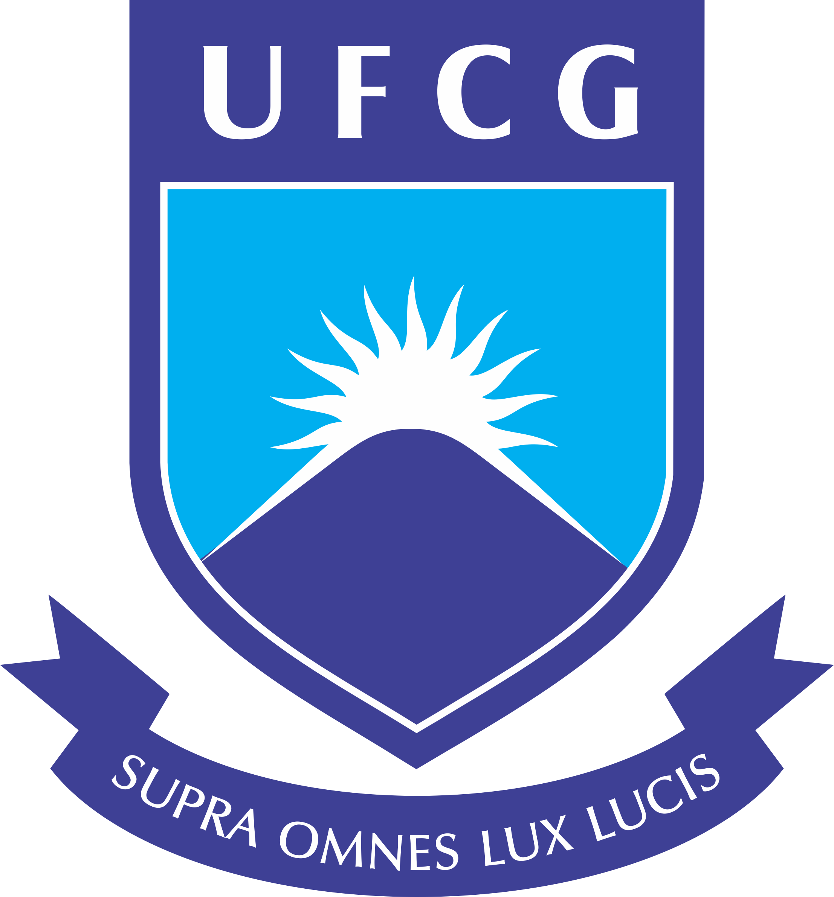

# 
 

# Física Matemática II
## Período 2020-1

### Professor
**Luciano Barosi**: lbarosi@df.ufcg.edu.br

### Ementa

*Funções de variável complexa. Séries de Fourier. Funções especiais. Equações diferenciais parciais com aplicações na Física. Solução de equações diferenciais por séries. Conjuntos de Funções Ortogonais. Soluções de EDPs por Transformadas Integrais.*

### Objetivos Gerais

Continuar a formação do aluno com respeito aos métodos matemáticos avançados utilizados na resolução de problemas físicos, permitindo a apresentação do instrumental necessário para a compreensão dos fenômenos, apresentando as técnicas matemáticas motivadas com problemas de relevância na Física.

### Objetivos Específicos

- Conhecer as equações diferenciais parciais importantes, como a equação de onda, difusão, Laplace, Poisson, Helmholtz e Schrödinger.
- Aprender a reconhecer e resolver problemas de Sturm Liouville.
- Aprender a executar soluções de equações pelo método de Frobenius.
- COmpreender as aplicações e propriedades de transformadas integrais, em particular Laplace e Fourier.

### Conteúdo Programático

| Aula | Conteúdo |
|------|----------|
| Aula 1 |  Introdução |
| Aula 2 | Funções de Variáveis complexas, funções analíticas e condições de cauchy-riemann |
| Aula 3 | Funções complexas como mapeamentos |
| Aula 4 | Teorema de Cauchy-Goursat, Teorema de Morera, Resíduos, Séries de Laurent |
| Aula 5 | Integrais por Resíduos |
| Aula 6 | Integrais por Resíduos |
| Aula 7 | Distribuições, Delta de Dirac e Função degrau |
| Aula 8 | Função de Green |
| Aula 9 | Transformada de Fourier |
| Aula 10 | Função de Green via transformada de Fourier |
| Aula 11 | Transformada de Fourier Discreta |
| Aula 12 | Transformada de Laplace |
| Aula 13 | Continuação Analítica |
| Aula 14 | Problemas de Sturm Liouville |
| Aula 15 | A corda vibrante. A membrana circular |
| Aula 16 | Funções de Legendre |
| Aula 17 | Funções de Bessel |
| Aula 18 | Funções de Fourier-Bessel |
| Aula 19 | Problemas de Valores de Contorno |
| Aula 20 | Equação de Laplace |
| Aula 21 | Equação de Poisson |
| Aula 22 | Equação de onda inhomogênea |
| Aula 23 | Função Gama |
| Aula 24 | Polinômios de Hermite |
| Aula 25 | Polinômios de Laguerre |
| Aula 26 | Funções Hipergeométricas |
| Aula 27 | Funções de Matthieu |

### Metodologia

O curso apresenta as aulas discutidas em notebooks Jupyter com Kernel Mathematica ou Python, visualização gráfica dos problemas, motivação física e apresentações no quadro.

### Avaliações

Duas avaliações serão trabalhos entregues ao longo do curso, com prazo de 1 mês para realização.

A frequência do aluno corresponde a terceira nota.

Uma quarta nota será atribuída para a participação do aluno no curso.

### Bibliografia

ARFKEN, G. Física Matemática, Métodos Matemáticos para Engenharia e Física. 1. ed. Rio de Janeiro: Campus, 2007

BOAS, M.L., Mathematical Methods in the Physical Sciences. John Wiley, 2005.

Kelly, James J., Graduate Mathematical Physics with Mathematica Supplements,  2006
